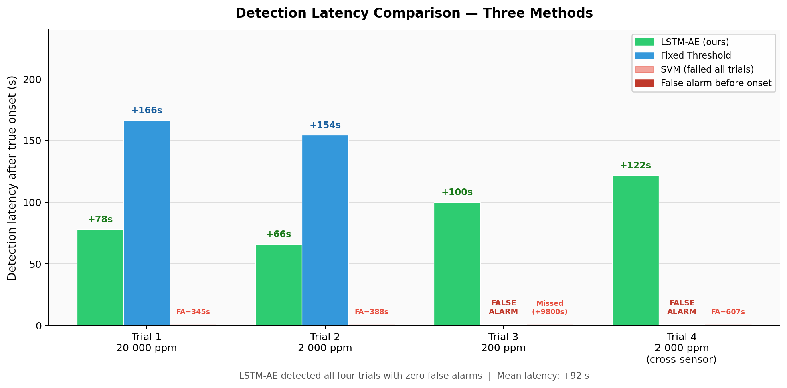
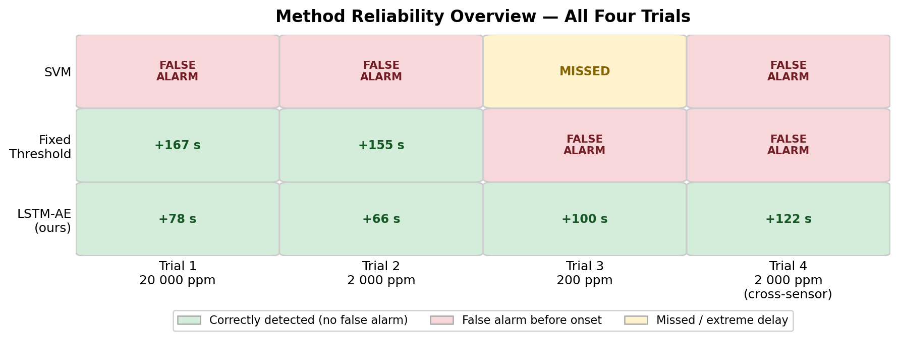
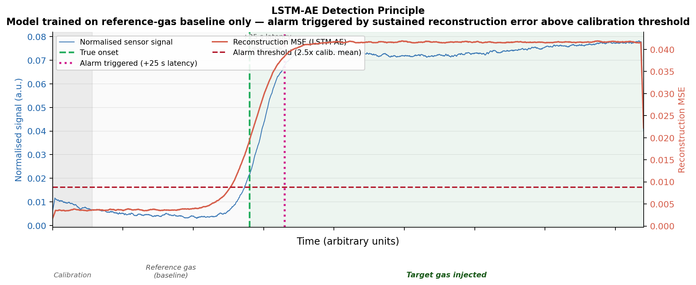
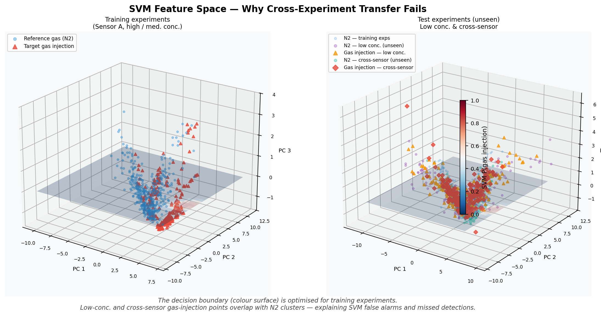
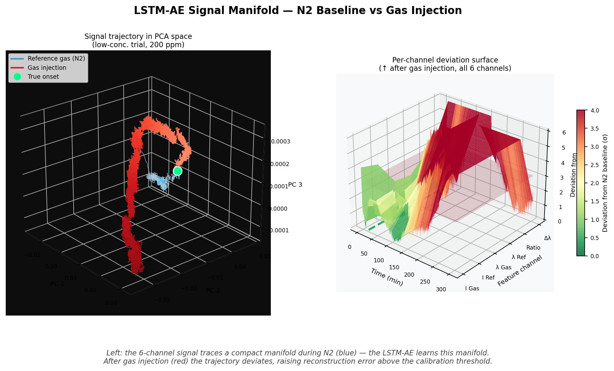

# Gas Leak Detection via Optical Sensors

Anomaly-detection pipeline for optical sensors.
Trains an LSTM Autoencoder on reference-gas baseline data only, then flags
sustained deviations in reconstruction error as leak events.
Includes an SVM baseline and a fixed-threshold baseline for comparison.

---

## Overview

| | Fixed Threshold | SVM | **LSTM-AE (ours)** |
|---|:---:|:---:|:---:|
| Training labels required | No | **Yes** | No |
| Robust to baseline drift | ✗ | ✗ | **✓** |
| Cross-sensor generalisation | ✗ | ✗ | **✓** |
| False alarms (4 trials) | 2 / 4 | 4 / 4 | **0 / 4** |
| Mean detection latency | +161 s* | N/A (all failed) | **+92 s** |

\* excludes trials with false alarms before onset

---

## Method

### LSTM Autoencoder (LSTM-AE)

The model is trained **exclusively on reference-gas (N2) baseline data** recorded before any injection event — no leak samples are required.

Six physical channels from the FBG sensor are used as input:

| Feature | Symbol | Description |
|---|---|---|
| Gas channel intensity | I\_Gas | Reflected intensity of the sensing grating |
| Reference channel intensity | I\_Ref | Reflected intensity of the reference grating |
| Gas channel Bragg wavelength | λ\_Gas | Peak wavelength of the sensing grating (nm) |
| Reference channel Bragg wavelength | λ\_Ref | Peak wavelength of the reference grating (nm) |
| Intensity ratio | I\_Gas / I\_Ref | Cross-channel normalised response |
| Differential wavelength | Δλ | λ\_Gas − λ\_Ref, temperature compensation term |

The autoencoder compresses each 30-second sliding window into a 16-dimensional latent vector and reconstructs it. During reference-gas conditions the reconstruction MSE is low. After gas injection the multi-channel pattern deviates from the learned manifold and MSE rises above the calibration threshold.

**Detection logic:**

```
Calibration (first 300 s)  →  calib_mean = mean(MSE)
Alarm threshold            =  calib_mean × 2.5
Alarm triggered when       ≥ 65 % of a 60-second rolling window exceeds threshold
```

### SVM Baseline

An RBF-kernel SVM is trained on 10 hand-engineered features derived from the normalised intensity ratio. It requires labelled gas-injection samples and is sensitive to cross-experiment feature distribution shift.

---

## Results

### Detection latency



LSTM-AE detects all four trials with **zero false alarms** and a mean latency of **+92 seconds** after true onset.
The fixed-threshold method produces false alarms in 2 of 4 trials.
The SVM fails in all 4 trials (false alarms or extreme missed detections).

### Method reliability overview



### Detection principle



The model is calibrated on the first 300 seconds of each deployment (reference gas only).
The alarm threshold is set automatically — no manual tuning required.

---

## 3D Visualisations

### SVM — why cross-experiment transfer fails



The SVM decision boundary (colour surface) is optimised for training experiments.
In the test experiments (right panel), low-concentration and cross-sensor gas-injection
points overlap with the N2 cluster — explaining the false alarms and missed detections.

### LSTM-AE — signal manifold



**Left:** The 6-channel signal traces a compact manifold during the reference-gas period (blue).
The LSTM-AE learns this manifold. After gas injection (red) the trajectory deviates visibly.

**Right:** Per-channel deviation surface. All six channels show elevated reconstruction
error (red) after injection, while the reference-gas period remains near zero (green).

---

## Repository Structure

```
├── lstm_ae_detector.py        # Main script — LSTM-AE detection (recommended entry point)
├── experiments.json           # Experiment configuration (file paths, onset times)
├── lstm_multifeature.py       # Earlier multi-feature LSTM-AE variant
├── cross_concentration_val.py # Cross-concentration / cross-sensor validation
├── loo_crossval.py            # Leave-one-out cross-validation experiment
├── derivative_ae.py           # Derivative-space autoencoder variant
├── autoencoder.py             # Single-channel autoencoder (baseline)
├── comparison_analysis.py     # Three-method quantitative comparison
├── comparison_data.json       # Pre-computed comparison results
├── svm_detector.py            # SVM detector (main)
├── svm_classify.py            # SVM classification utilities
├── svm_detect.py              # SVM detection pipeline
└── DATA/                      # Sensor CSV files (not included — proprietary)
```

---

## Usage

```bash
# Run with default parameters (reads experiments.json):
python lstm_ae_detector.py

# Adjust detection sensitivity:
python lstm_ae_detector.py --threshold-mult 3.0 --persist-sec 45

# Change model size or training length:
python lstm_ae_detector.py --hidden 128 --latent 32 --epochs 300

# Use a custom experiment config:
python lstm_ae_detector.py --config my_experiments.json

# Full parameter list:
python lstm_ae_detector.py --help
```

### experiments.json format

```json
[
  {
    "file":          "recording_01.csv",
    "sep":           ",",
    "col_offset":    0,
    "onset_s":       696,
    "h2_end_s":      3396,
    "concentration": "20 000 ppm",
    "sensor":        "Sens1"
  }
]
```

### Key parameters

| Argument | Default | Description |
|---|---|---|
| `--window-sec` | 30 | Sliding window length (seconds) |
| `--calib-sec` | 300 | Calibration zone duration (seconds) |
| `--threshold-mult` | 2.5 | Alarm threshold = calib mean × this value |
| `--persist-sec` | 60 | Persistence confirmation window (seconds) |
| `--persist-frac` | 0.65 | Fraction of window that must be flagged |
| `--hidden` | 64 | LSTM hidden state size |
| `--latent` | 16 | Bottleneck latent dimension |
| `--epochs` | 200 | Training epochs |

---

## Requirements

```
torch
numpy
pandas
scikit-learn
scipy
matplotlib
```

Install with:

```bash
pip install torch numpy pandas scikit-learn scipy matplotlib
```

---

## Data Format

Each CSV file is expected to contain columns (per sensor block, starting at `col_offset`):

```
col+0: time (s)
col+1: λ_Ref (nm)
col+2: I_Ref (a.u.)
col+3: λ_Gas (nm)
col+4: I_Gas (a.u.)
```

If two sensor datasets are packed in one file, set `col_offset: 5` for the second block.
